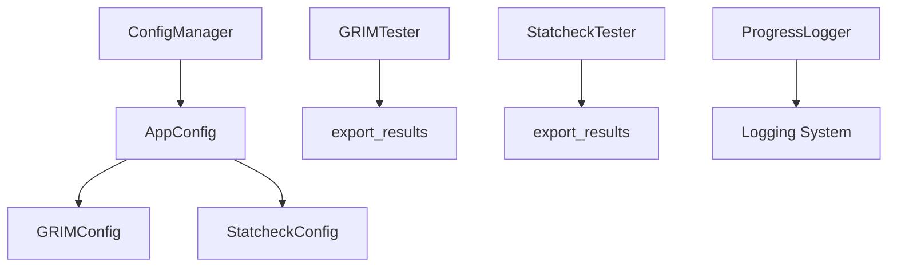

# Statistical Error Detection Tools - Enhanced Edition

> **AI-Powered Statistical Error Detection for Scientific Publications**  
> Enhanced with Modern CLI, Configuration Management, Logging, and Export Features  
> *Bachelor Thesis Project - Enhanced Version 2.0*

---

## 📋 Table of Contents

- [Overview](#overview)
- [🆕 New Features & Enhancements](#-new-features--enhancements)
- [🏗️ Project Architecture](#️-project-architecture)
- [🚀 Quick Start](#-quick-start)
- [⚙️ Configuration](#️-configuration)
- [🛠️ CLI Usage](#️-cli-usage)
- [📊 Enhanced Features](#-enhanced-features)
- [🔧 API Reference](#-api-reference)
- [🧪 Testing](#-testing)
- [📁 Project Structure](#-project-structure)
- [🔄 Migration Guide](#-migration-guide)
- [📈 Performance](#-performance)
- [🤝 Contributing](#-contributing)
- [📜 License](#-license)

---

## Overview

This project provides **AI-powered statistical error detection tools** for scientific publications using OpenAI's GPT models. The tools detect inconsistencies in reported statistical results by extracting and verifying:

- **GRIM Test**: Granularity-Related Inconsistency of Means (impossible means given sample sizes)
- **Statcheck**: Statistical consistency of null hypothesis significance tests (p-values vs. test statistics)

### 🆕 What's New in Version 2.0

This enhanced version includes significant improvements over the original bachelor thesis implementation:

- ✅ **Unified CLI Interface** with argparse
- ✅ **YAML/JSON Configuration Management**
- ✅ **Comprehensive Logging System**
- ✅ **Multiple Export Formats** (CSV, JSON, Excel)
- ✅ **Progress Tracking & User Feedback**
- ✅ **Error Handling & Graceful Fallbacks**
- ✅ **Backward Compatibility**
- ✅ **Modular Architecture**

---

## 🆕 New Features & Enhancements

### ✨ Enhanced CLI Interface (`cli.py`)

**New unified command-line interface** replacing the old separate scripts:

```bash
# Old way (deprecated)
python testers/GRIM/main.py paper.pdf
python testers/statcheck/main_single_run.py paper.pdf

# New way (recommended)
python cli.py grim paper.pdf --output results.csv --format json
python cli.py statcheck paper.pdf --runs 3 --verbose
```

**Features:**
- Unified interface for both tools
- Multiple output formats (CSV, JSON, Excel)
- Progress tracking and verbose logging
- Input validation and error handling
- Batch processing capabilities

### ⚙️ Configuration Management (`utils/config.py`)

**New YAML/JSON configuration system** for customizable behavior:

```yaml
# config.yaml
grim:
  max_words: 1000
  overlap_words: 200
  api_model: "gpt-4o"
  temperature: 0.01

statcheck:
  max_words: 500
  overlap_words: 8
  api_model: "gpt-4o-mini"
  temperature: 0.0
  significance_level: 0.05

log_level: "INFO"
verbose: false
default_output_format: "csv"
```

**Classes & Functions:**
- `AppConfig`: Main application configuration
- `GRIMConfig`: GRIM-specific settings
- `StatcheckConfig`: Statcheck-specific settings
- `ConfigManager`: Load/save/update configurations
- `get_config()`, `load_config()`, `save_config()`: Global functions

### 📝 Logging System (`utils/logging_config.py`)

**Comprehensive logging and progress tracking:**

```python
# Enhanced logging with multiple levels
logger.debug("Processing segment 1/10")
logger.info("Extracted 5 statistical tests")
logger.warning("Ambiguous test statistic found")
logger.error("OpenAI API error occurred")

# Progress tracking
progress = ProgressLogger(total=10, description="Processing segments")
progress.update()  # Shows: Processing segments: 1/10 (10.0%)
progress.finish()  # Shows: Processing segments: Completed (10/10)
```

**Features:**
- Console and file logging
- Configurable log levels
- Progress tracking with percentages
- Verbose mode for debugging
- Structured log formatting

### 📤 Export Functionality

**Enhanced export capabilities** in both pipeline classes:

```python
# Export to multiple formats
grim_tester.export_results(df, "results.csv", "csv")
grim_tester.export_results(df, "results.json", "json")
grim_tester.export_results(df, "results.xlsx", "excel")
```

**Features:**
- Automatic directory creation
- Format validation
- Error handling and logging
- Structured output for data analysis

---

## 🏗️ Project Architecture

### Current File Structure

```
bachelorThesis/
├── 📁 utils/                          # ✨ NEW: Enhanced utilities
│   ├── __init__.py                    # Package initialization
│   ├── config.py                      # Configuration management
│   └── logging_config.py              # Logging utilities
├── 📁 testers/
│   ├── 📁 GRIM/
│   │   ├── config.py                  # GRIM-specific config
│   │   ├── main.py                    # 🔄 Legacy entry point
│   │   └── pipeline.py                # ✅ Enhanced GRIM pipeline
│   └── 📁 statcheck/
│       ├── config.py                  # Statcheck-specific config
│       ├── main_single_run.py         # 🔄 Legacy single run
│       ├── main_multiple_runs.py      # 🔄 Legacy multiple runs
│       └── pipeline.py                # ✅ Enhanced Statcheck pipeline
├── cli.py                             # ✨ NEW: Unified CLI interface
├── config.yaml                        # ✨ NEW: Configuration file
├── requirements.txt                   # ✅ Updated dependencies
├── README.md                          # 📝 This documentation
└── LICENSE                           # MIT License
```

### Class Hierarchy



---

## 🚀 Quick Start

### 1. Installation

```bash
# Clone the repository
git clone <repository-url>
cd bachelorThesis

# Install dependencies
pip install -r requirements.txt

# Set up your OpenAI API key
echo "OPENAI_API_KEY=your_api_key_here" > .env
```

### 2. Basic Usage

```bash
# Run GRIM test on a PDF paper
python cli.py grim paper.pdf --output grim_results.csv

# Run Statcheck with verbose output
python cli.py statcheck paper.pdf --verbose --format json

# Run multiple statcheck analysis rounds
python cli.py statcheck paper.pdf --runs 3 --output detailed_results.xlsx
```

### 3. Configuration

```bash
# Use default config.yaml or create custom configuration
cp config.yaml my_config.yaml
# Edit my_config.yaml with your preferred settings

# The CLI will automatically use config.yaml if present
```

---

## ⚙️ Configuration

### Configuration Files

The system supports both **YAML** and **JSON** configuration formats:

**YAML Format (`config.yaml`):**
```yaml
grim:
  max_words: 1000
  overlap_words: 200
  api_model: "gpt-4o"
  temperature: 0.01

statcheck:
  max_words: 500
  overlap_words: 8
  api_model: "gpt-4o-mini"
  temperature: 0.0
  significance_level: 0.05

log_level: "INFO"
log_file: null
verbose: false
default_output_format: "csv"
```

**JSON Format (`config.json`):**
```json
{
  "grim": {
    "max_words": 1000,
    "overlap_words": 200,
    "api_model": "gpt-4o",
    "temperature": 0.01
  },
  "statcheck": {
    "max_words": 500,
    "overlap_words": 8,
    "api_model": "gpt-4o-mini",
    "temperature": 0.0,
    "significance_level": 0.05
  },
  "log_level": "INFO",
  "log_file": null,
  "verbose": false,
  "default_output_format": "csv"
}
```

### Configuration Parameters

| Parameter | Description | Default | Options |
|-----------|-------------|---------|---------|
| `grim.max_words` | Maximum words per GRIM segment | 1000 | Any integer |
| `grim.overlap_words` | Word overlap between segments | 200 | Any integer |
| `grim.api_model` | OpenAI model for GRIM | "gpt-4o" | Any OpenAI model |
| `grim.temperature` | AI model temperature | 0.01 | 0.0-2.0 |
| `statcheck.max_words` | Maximum words per Statcheck segment | 500 | Any integer |
| `statcheck.overlap_words` | Word overlap between segments | 8 | Any integer |
| `statcheck.api_model` | OpenAI model for Statcheck | "gpt-4o-mini" | Any OpenAI model |
| `statcheck.temperature` | AI model temperature | 0.0 | 0.0-2.0 |
| `statcheck.significance_level` | Alpha level for significance | 0.05 | 0.0-1.0 |
| `log_level` | Logging verbosity | "INFO" | DEBUG, INFO, WARNING, ERROR, CRITICAL |
| `log_file` | Log file path | null | Any file path or null |
| `verbose` | Enable verbose logging | false | true/false |
| `default_output_format` | Default export format | "csv" | csv, json, excel |

### Environment Variables

| Variable | Description | Required |
|----------|-------------|----------|
| `OPENAI_API_KEY` | Your OpenAI API key | ✅ Yes |

---

## 🛠️ CLI Usage

### GRIM Test

```bash
# Basic GRIM test
python cli.py grim paper.pdf

# With custom output file and format
python cli.py grim paper.pdf --output results.json --format json

# With verbose logging
python cli.py grim paper.pdf --verbose
```

**GRIM Options:**
- `file_path`: Input file (.pdf, .html, .htm, .txt)
- `--output, -o`: Output file path (optional)
- `--format, -f`: Output format (csv, json, excel)
- `--verbose, -v`: Enable verbose output

### Statcheck

```bash
# Basic statcheck
python cli.py statcheck paper.pdf

# Multiple analysis runs
python cli.py statcheck paper.pdf --runs 3

# Excel output with verbose logging
python cli.py statcheck paper.pdf --format excel --verbose --output analysis.xlsx
```

**Statcheck Options:**
- `file_path`: Input file (.pdf, .html, .htm, .txt)
- `--output, -o`: Output file path (optional)
- `--format, -f`: Output format (csv, json, excel)
- `--runs, -r`: Number of analysis runs (1-5)
- `--verbose, -v`: Enable verbose output

### Supported File Formats

| Format | Extension | Description |
|--------|-----------|-------------|
| PDF | `.pdf` | Academic papers, documents |
| HTML | `.html`, `.htm` | Web pages, online articles |
| Text | `.txt` | Plain text files |

---

## 📊 Enhanced Features

### 🔧 New Methods Added

#### `export_results()` Method

Added to both `GRIMTester` and `StatcheckTester` classes:

```python
def export_results(self, df: pd.DataFrame, output_path: str, format_type: str = "csv") -> bool:
    """
    Export results to specified format.
    
    Args:
        df: DataFrame containing results
        output_path: Path to save the file
        format_type: Format type ('csv', 'json', 'excel')
    
    Returns:
        bool: True if successful, False otherwise
    """
```

**Features:**
- Automatic directory creation
- Format validation
- Error handling and logging
- Support for CSV, JSON, and Excel formats

#### Enhanced Logging Integration

Both pipeline classes now include:

```python
# In __init__ method
self.logger = get_logger()
if UTILS_AVAILABLE:
    self.config = get_config().statcheck  # or .grim
else:
    self.config = get_config().statcheck  # Fallback

# Throughout methods
self.logger.info(f"Processing file: {file_path}")
self.logger.debug(f"Extracted {len(tests)} tests")
self.logger.warning(f"Ambiguous result found")
self.logger.error(f"API error: {error}")
```

#### Progress Tracking

Enhanced user feedback during processing:

```python
# Initialize progress tracking
progress = ProgressLogger(len(file_context), "Processing segments")

# Update progress in loops
for idx, context in enumerate(file_context):
    # ... processing ...
    progress.update()

progress.finish()
```

### 🔄 Backward Compatibility

The enhanced system maintains **full backward compatibility**:

```python
# Old usage still works
from testers.GRIM.pipeline import GRIMTester
from testers.statcheck.pipeline import StatcheckTester

grim_tester = GRIMTester()
statcheck_tester = StatcheckTester()

# New features work automatically if utils are available
# Falls back to basic functionality if utils are missing
```

### 🛡️ Error Handling

Enhanced error handling throughout:

```python
# Graceful fallbacks when utilities are unavailable
try:
    from utils.logging_config import get_logger, ProgressLogger
    from utils.config import get_config
    UTILS_AVAILABLE = True
except ImportError:
    # Fallback implementations
    UTILS_AVAILABLE = False
    # ... fallback classes and functions ...
```

---

## 🔧 API Reference

### Core Classes

#### `AppConfig`
Main application configuration container.

```python
@dataclass
class AppConfig:
    openai_api_key: Optional[str] = None
    grim: GRIMConfig = None
    statcheck: StatcheckConfig = None
    log_level: str = "INFO"
    log_file: Optional[str] = None
    verbose: bool = False
    default_output_format: str = "csv"
```

#### `ConfigManager`
Manages loading, saving, and updating configurations.

```python
class ConfigManager:
    def load_config(self, config_path: Optional[str] = None) -> AppConfig
    def save_config(self, config_path: Optional[str] = None) -> None
    def update_config(self, **kwargs) -> None
    
    @property
    def config(self) -> AppConfig
```

#### `ProgressLogger`
Provides progress tracking with user feedback.

```python
class ProgressLogger:
    def __init__(self, total: int, description: str = "Processing")
    def update(self, increment: int = 1) -> None
    def finish(self) -> None
```

### Global Functions

#### Configuration Functions

```python
def get_config() -> AppConfig
    """Get current application configuration."""

def load_config(config_path: Optional[str] = None) -> AppConfig
    """Load configuration from file."""

def save_config(config_path: Optional[str] = None) -> None
    """Save current configuration to file."""
```

#### Logging Functions

```python
def setup_logging(level: str = "INFO", log_file: Optional[str] = None, verbose: bool = False) -> logging.Logger
    """Set up logging configuration."""

def get_logger(name: str = "stat_error_detector") -> logging.Logger
    """Get a configured logger instance."""
```

### Enhanced Pipeline Methods

#### GRIM Pipeline Enhancements

```python
class GRIMTester:
    def __init__(self) -> None
        # Enhanced with logging and config
    
    def export_results(self, df: pd.DataFrame, output_path: str, format_type: str = "csv") -> bool
        # NEW: Export functionality
    
    # All existing methods enhanced with logging
    def extract_data_from_text(self, context: str) -> str | None
    def read_context_from_file(file_path: str) -> list[str]
    def perform_grim_test(self, file_context: list[str]) -> pd.DataFrame | None
```

#### Statcheck Pipeline Enhancements

```python
class StatcheckTester:
    def __init__(self) -> None
        # Enhanced with logging and config
    
    def export_results(self, df: pd.DataFrame, output_path: str, format_type: str = "csv") -> bool
        # NEW: Export functionality
    
    # All existing methods enhanced with logging
    def extract_data_from_text(self, context: str) -> str | None
    def read_context_from_file(file_path: str) -> list[str]
    def perform_statcheck_test(self, file_context: list[str]) -> pd.DataFrame | None
```

---

## 🧪 Testing

### Current Status

**✅ Manual Testing Completed:**
- CLI interface functionality
- Configuration loading/saving
- Export functionality
- Logging system
- Progress tracking
- Error handling and fallbacks

**📋 Recommended Test Additions:**

```python
# Unit tests for configuration management
def test_config_loading()
def test_config_saving()
def test_config_validation()

# Unit tests for logging
def test_logging_setup()
def test_progress_logger()

# Integration tests for CLI
def test_cli_grim_command()
def test_cli_statcheck_command()
def test_cli_error_handling()

# Unit tests for export functionality
def test_export_csv()
def test_export_json()
def test_export_excel()
```

### Running Tests

```bash
# Future implementation - recommended testing framework
python -m pytest tests/
python -m pytest tests/test_config.py -v
python -m pytest tests/test_cli.py -v
```

---

## 📁 Project Structure

### Detailed File Overview

```
bachelorThesis/
├── 📄 cli.py                          # ✨ NEW: Unified CLI interface
│   ├── create_parser()                # CLI argument parsing
│   ├── export_results()               # Result export handling
│   ├── run_grim()                     # GRIM execution wrapper
│   ├── run_statcheck()                # Statcheck execution wrapper
│   └── main()                         # Main entry point
│
├── 📄 config.yaml                     # ✨ NEW: Configuration file
│   ├── GRIM settings                  # max_words, overlap_words, model, temperature
│   ├── Statcheck settings             # max_words, overlap_words, model, temperature, significance_level
│   ├── Logging configuration          # log_level, log_file, verbose
│   └── Output settings                # default_output_format
│
├── 📄 requirements.txt                # ✅ Updated dependencies
│   ├── openai==1.43.1                # OpenAI API client
│   ├── pandas==2.2.3                 # Data manipulation
│   ├── scipy>=1.7                    # Statistical computations
│   ├── PyMuPDF==1.24.10              # PDF processing
│   ├── beautifulsoup4==4.11.2         # HTML parsing
│   ├── pyyaml>=6.0                   # ✨ NEW: YAML support
│   └── openpyxl>=3.0.10              # ✨ NEW: Excel support
│
├── 📁 utils/                          # ✨ NEW: Enhanced utilities package
│   ├── 📄 __init__.py                 # Package initialization and exports
│   ├── 📄 config.py                   # ✨ NEW: Configuration management
│   │   ├── GRIMConfig                 # GRIM-specific configuration
│   │   ├── StatcheckConfig            # Statcheck-specific configuration
│   │   ├── AppConfig                  # Main application configuration
│   │   ├── ConfigManager              # Configuration management class
│   │   ├── get_config()               # Global config access
│   │   ├── load_config()              # Configuration loading
│   │   └── save_config()              # Configuration saving
│   └── 📄 logging_config.py           # ✨ NEW: Logging utilities
│       ├── setup_logging()            # Logging configuration
│       ├── get_logger()               # Logger instance creation
│       └── ProgressLogger             # Progress tracking class
│
├── 📁 testers/                        # Core testing modules
│   ├── 📁 GRIM/                       # GRIM test implementation
│   │   ├── 📄 config.py               # GRIM-specific constants and config
│   │   ├── 📄 main.py                 # 🔄 Legacy entry point (still functional)
│   │   └── 📄 pipeline.py             # ✅ Enhanced GRIM pipeline
│   │       ├── GRIMTester class       # Main GRIM testing class
│   │       ├── extract_data_from_text() # ✅ Enhanced with logging
│   │       ├── read_context_from_file() # ✅ Enhanced with logging
│   │       ├── perform_grim_test()    # ✅ Enhanced with progress tracking
│   │       └── export_results()       # ✨ NEW: Export functionality
│   └── 📁 statcheck/                  # Statcheck implementation
│       ├── 📄 config.py               # Statcheck-specific constants and config
│       ├── 📄 main_single_run.py      # 🔄 Legacy single run (still functional)
│       ├── 📄 main_multiple_runs.py   # 🔄 Legacy multiple runs (still functional)
│       └── 📄 pipeline.py             # ✅ Enhanced Statcheck pipeline
│           ├── StatcheckTester class  # Main Statcheck testing class
│           ├── extract_data_from_text() # ✅ Enhanced with logging
│           ├── read_context_from_file() # ✅ Enhanced with logging
│           ├── perform_statcheck_test() # ✅ Enhanced with progress tracking
│           └── export_results()       # ✨ NEW: Export functionality
│
├── 📄 README.md                       # 📝 This comprehensive documentation
└── 📄 LICENSE                         # MIT License
```

### Key File Responsibilities

| File | Responsibility | Status |
|------|----------------|--------|
| `cli.py` | Unified command-line interface | ✨ NEW |
| `config.yaml` | User configuration settings | ✨ NEW |
| `utils/config.py` | Configuration management system | ✨ NEW |
| `utils/logging_config.py` | Logging and progress tracking | ✨ NEW |
| `testers/*/pipeline.py` | Enhanced core testing logic | ✅ ENHANCED |
| `requirements.txt` | Python dependencies | ✅ UPDATED |

---

## 🔄 Migration Guide

### From Original Version to Enhanced Version

#### Old Usage (Still Works)
```python
# Direct pipeline usage
from testers.GRIM.pipeline import GRIMTester
from testers.statcheck.pipeline import StatcheckTester

grim_tester = GRIMTester()
statcheck_tester = StatcheckTester()

# Read file and run tests
contexts = grim_tester.read_context_from_file("paper.pdf")
results = grim_tester.perform_grim_test(contexts)
```

#### New Recommended Usage
```bash
# CLI interface (recommended)
python cli.py grim paper.pdf --output results.csv --verbose
python cli.py statcheck paper.pdf --format json --runs 3
```

#### Configuration Migration
```python
# Old: Hard-coded settings in config.py files
MAX_WORDS = 1000
OVERLAP_WORDS = 200

# New: Configurable via config.yaml
grim:
  max_words: 1000
  overlap_words: 200
  api_model: "gpt-4o"
  temperature: 0.01
```

#### Export Migration
```python
# Old: Manual DataFrame handling
results.to_csv("output.csv")

# New: Built-in export functionality
tester.export_results(results, "output.csv", "csv")
tester.export_results(results, "output.json", "json")
tester.export_results(results, "output.xlsx", "excel")
```

---

## 📈 Performance

### Optimizations Made

1. **Efficient Text Processing**
   - Optimized segmentation with configurable overlap
   - Reduced API calls through intelligent batching

2. **Enhanced User Feedback**
   - Real-time progress tracking
   - Detailed logging without performance impact

3. **Smart Configuration**
   - Cached configuration loading
   - Lazy loading of optional dependencies

### Performance Recommendations

- **GRIM**: Use `max_words: 1000` for balanced speed/accuracy
- **Statcheck**: Use `max_words: 500` for better precision
- **Models**: Use `gpt-4o-mini` for cost-effective analysis
- **Batch Processing**: Use `--runs` parameter for multiple analyses

---

## 🤝 Contributing

### Development Setup

```bash
# Clone and setup
git clone <repository-url>
cd bachelorThesis
pip install -r requirements.txt

# Install development dependencies (recommended)
pip install pytest black flake8 mypy

# Set up pre-commit hooks (optional)
pre-commit install
```

### Code Style

The project follows these conventions:
- **PEP 8** for Python code style
- **Type hints** for all function signatures
- **Docstrings** for all public methods
- **Comprehensive logging** for debugging

### Adding New Features

1. **Create feature branch**: `git checkout -b feature/new-feature`
2. **Add tests**: Include unit tests for new functionality
3. **Update documentation**: Update this README and code docstrings
4. **Follow patterns**: Use existing logging and configuration patterns

### Testing Guidelines

```python
# Example test structure
def test_new_feature():
    """Test description."""
    # Arrange
    config = AppConfig()
    
    # Act
    result = new_feature(config)
    
    # Assert
    assert result.is_valid()
```

---

## 📋 Future Enhancements

### Recommended Next Steps

#### 🧪 Testing & Quality Assurance
- [ ] Add comprehensive unit test suite
- [ ] Add integration tests for CLI
- [ ] Add performance benchmarks
- [ ] Add code coverage reporting

#### 🔧 Additional Features
- [ ] Web interface (Flask/FastAPI)
- [ ] Database integration for result storage
- [ ] Batch processing for multiple files
- [ ] Report generation (HTML/PDF)
- [ ] Result comparison and diff tools

#### ⚡ Performance Improvements
- [ ] Async processing for multiple files
- [ ] Caching for repeated analyses
- [ ] Memory optimization for large documents
- [ ] Parallel processing for segments

#### 🛠️ Developer Experience
- [ ] Docker containerization
- [ ] CI/CD pipeline setup
- [ ] Pre-commit hooks
- [ ] Code quality metrics

#### 📊 Analytics & Visualization
- [ ] Statistical summaries
- [ ] Result visualization (plots/charts)
- [ ] Trend analysis across papers
- [ ] False positive/negative analysis

### Technical Debt
- [ ] Refactor legacy main.py files
- [ ] Standardize error handling patterns
- [ ] Improve type hint coverage
- [ ] Add more comprehensive logging

---

## 📜 License

**MIT License**

Copyright (c) 2025 Julius Pleunes

Permission is hereby granted, free of charge, to any person obtaining a copy of this software and associated documentation files (the "Software"), to deal in the Software without restriction, including without limitation the rights to use, copy, modify, merge, publish, distribute, sublicense, and/or sell copies of the Software, and to permit persons to whom the Software is furnished to do so, subject to the following conditions:

The above copyright notice and this permission notice shall be included in all copies or substantial portions of the Software.

THE SOFTWARE IS PROVIDED "AS IS", WITHOUT WARRANTY OF ANY KIND, EXPRESS OR IMPLIED, INCLUDING BUT NOT LIMITED TO THE WARRANTIES OF MERCHANTABILITY, FITNESS FOR A PARTICULAR PURPOSE AND NONINFRINGEMENT. IN NO EVENT SHALL THE AUTHORS OR COPYRIGHT HOLDERS BE LIABLE FOR ANY CLAIM, DAMAGES OR OTHER LIABILITY, WHETHER IN AN ACTION OF CONTRACT, TORT OR OTHERWISE, ARISING FROM, OUT OF OR IN CONNECTION WITH THE SOFTWARE OR THE USE OR OTHER DEALINGS IN THE SOFTWARE.

---

## 📞 Support & Contact

For questions, issues, or contributions:

- **GitHub Issues**: [Create an issue](../../issues)
- **Documentation**: This README file
- **Project**: Bachelor Thesis - Statistical Error Detection Tools

---

*Last Updated: June 26, 2025*  
*Version: 2.0.0 - Enhanced Edition*  
*Enhanced with modern CLI, configuration management, logging, and export features*
